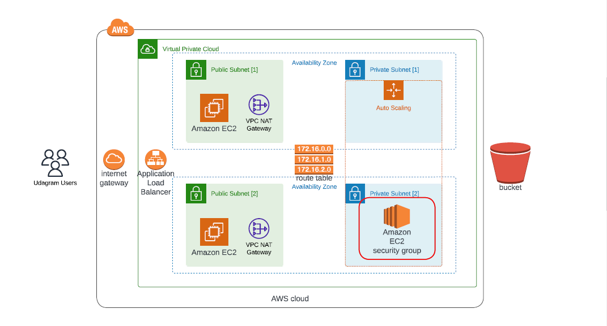

# Deploy a high-availability new application using AWS CloudFormation infrastructure.

## Architecture Diagram

 
### File Structure

1. `create.sh` 
    * use ssh key to deploy server into Public Subnets,  helps with troubleshooting.

2. `network-infrastructure.yml` `network-parameters.json`
    * contains network resources to be deployed
    * includes VPC, two pairs of public and private subnets, Internet Gateway, NAT Gateways and Routing Tables for public and private subnets with associations

3. `server-infrastructure.yml` `server-parameters.json`
    * contains app resources to be deployed
    * includes Application services. In particular, Load Balancer, web servers and corresponding autoscaling, target and security groups.

4. `update.sh`
    * stack updates

- Bastion hosts _(Optional)_. EC2 instances for troubleshooting of application web servers.
 * TODO

## Infrastructure Deployment

### Instructions

### Application Configurations:

Use AWS console or AWS ClI to create:

 - an IAM profile and AMI Role
 - security Key pair for your Instance.
 - an EC2 Instance to connect its public DNS to your keypair 
 - s3 bucket - to downloading the application archive

Configure security groups:

 - inbound port open at `Http Port:80` to use it with Load balancer and Load balancer health checks
 - allow all public traffic `(0.0.0.0/0)` on `port:80` inbound
 - outbound default `HTTP port:80` to reach internal servers.  

2. Deploy networks Infrastructure:

- Run: the shell script `create.sh` using EC2 instance public DNS
 * create network infrastructure cloudformation stacks:
- Run:`./create.sh networkinfrastructure network-infrastructure.yml network-parameters.json`

3. Deploying servers Infrastructure:

- Run: the shell script `create.sh` using EC2 instance public DNS
 * create servers infrastructure cloudformation stacks:
- Run: `./create.sh serverinfrastructure server-infrastructure.yml server-parameters.json`

4. Check cloud formation stack creation status:

- Run the shell script `create.sh` using EC2 instance public DNS
 * Run: `aws cloudformation list-stacks --stack-status-filter CREATE_COMPLETE`

5. Update Infrastructure Cloud Formation stack:

- Run the shell script `update.sh` using EC2 instance public DNS
 * update network infrastructure cloudformation stacks:
- Run: `./update.sh networkinfrastructure network-infrastructure.yml network-parameters.json`

6. Update Infrastructure Cloud Formation stack:

- Run the shell script `update.sh` using EC2 instance public DNS
 * update server infrastructure cloudformation stacks:
- Run: `./update.sh serverinfrastructure server-infrastructure.yml server-parameters.json
`

### Output
Access Application with LoadBalancer public DNS url: **[Udagram](http://serve-WebAp-161GK7Q8AC2BX-657455822.us-east-1.elb.amazonaws.com)**.

